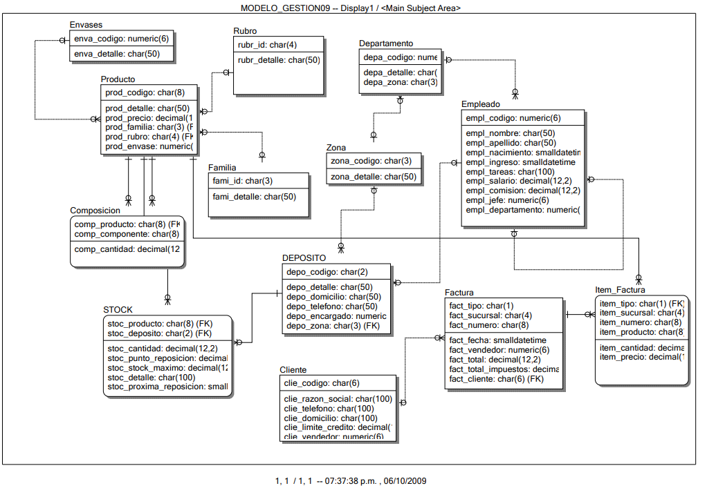

📚 Gestion de datos - Ejercicios de práctica de SQL

Este repositorio contiene una colección de ejercicios de práctica de SQL para el motor de base de datos de SQL Server 

📁 Estructura del repositorio

Este repositorio contiene los archivos "Practica de SQL" y "Práctica de T-SQL" que incluyen ejercicios con las cuales se ira practicando las consultas SQL. Además, el archivo "GD2015C1" proporciona un punto de restauracion de una db con registros cargados para empezar la practica.
Dentro de las carpetas "SQL" y "T-SQL" se encontraran las soluciones de los respectivos ejercicios.

🎯 Objetivo

El objetivo de este repositorio es mejorar y entender mejor cómo funcionan las diferentes consultas y aspectos relacionados con SQL en el motor de base de datos de SQL Server.

Modelo DER:

Materia: Gestion de datos - UTNBA